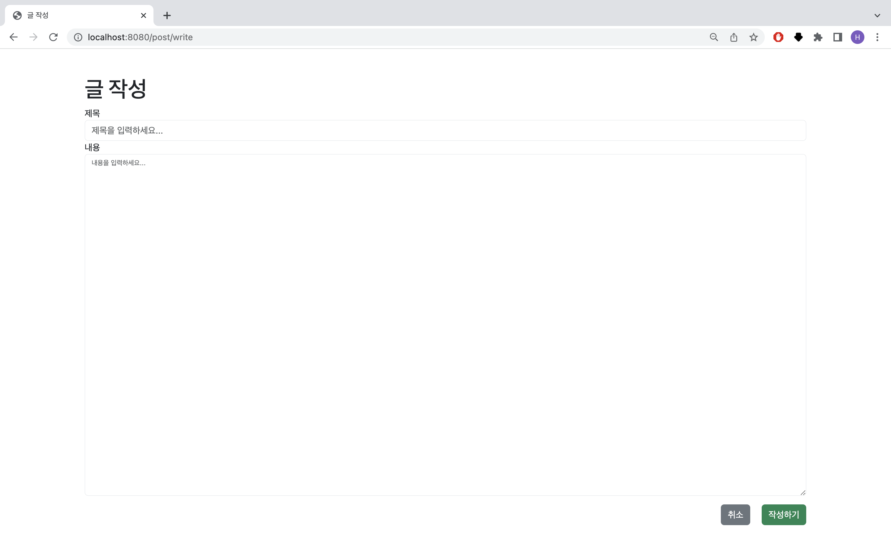
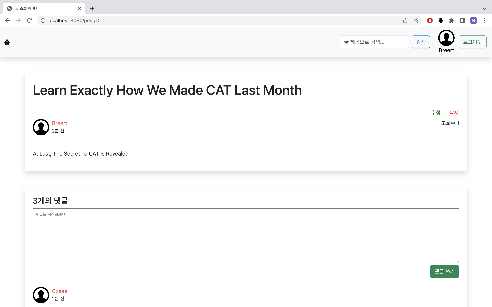
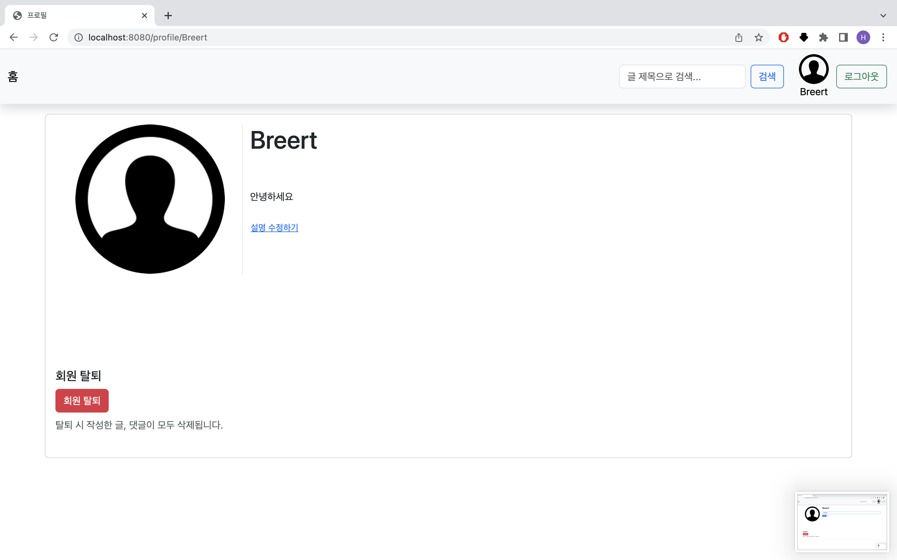

# 스프링 게시판

## 프로젝트 목적

- Spring JPA, MVC 학습 및 활용

## 프로젝트 기간

## 기술 스택

- Spring
- Spring JPA
- Spring MVC
- Spring validation
- Thymeleaf

## 구현 기능

- member
	- 유저 회원가입
	- 유저 로그인
	- 유저 b로그아웃
	- 유저 회원탈퇴
	- 유저 프로필 보기
	- 유저 프로필 소개 수정
- post
	- 글 쓰기
	- 글 수정
	- 글 삭제
	- 글 보기
	- 글 조회수 기능
- comment
	- 댓글 쓰기
	- 댓글 삭제

- 홈페이지 글 리스트 페이지네이션
- 글 제목으로 검색
- 인터셉터, 세션, 쿠키 로그인
- member, post Entity bean validation
- 유저 아이디 회원가입시 중복체크

## 스크린샷

### 홈 페이지

### 로그인 페이지

### 비로그인 유저 로그인페이지 리다이렉션

### 회원가입 페이지

### 회원가입 필드 검증

### 회원가입 중복아이디 체크

### 글 쓰기 페이지

### 글 수정 페이지

### 글 조회 페이지

### 내 댓글 삭제

### 유저 프로필 페이지

### 유저 프로필 소개 수정

### 유저 프로필 소개 수정 완료

